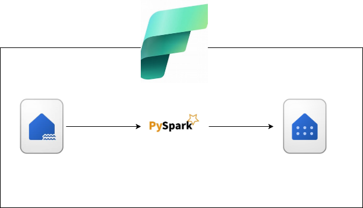
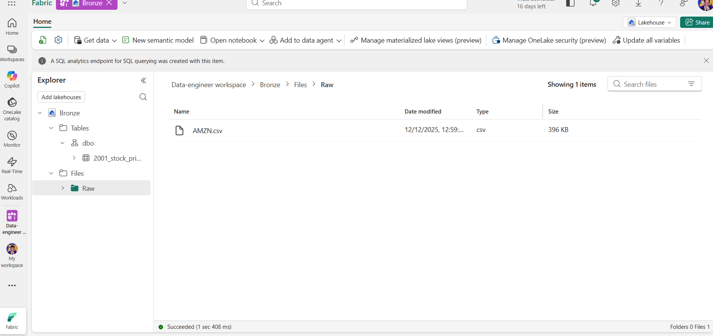
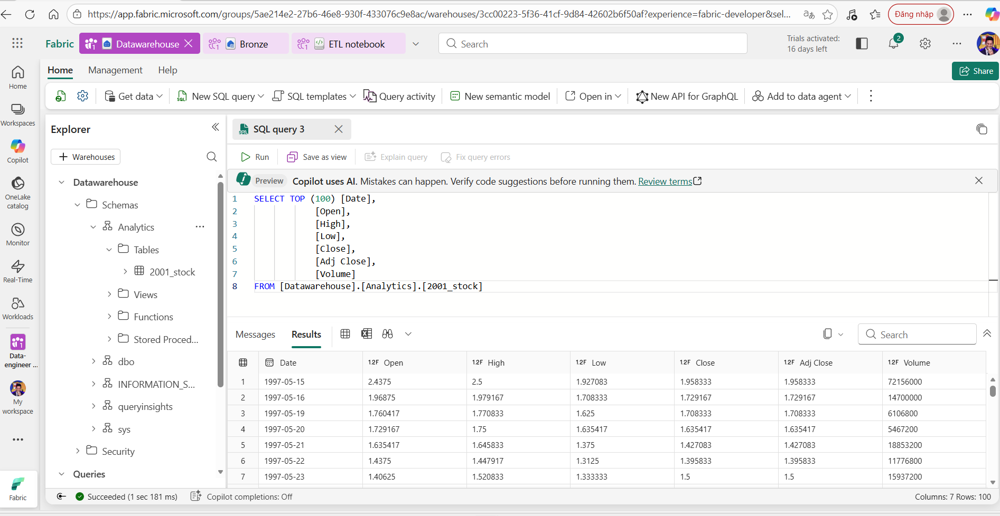

# pyspark_fabric
# 🚀 ETL Project: Lakehouse ➜ Data Warehouse using PySpark (Microsoft Fabric)

## 📌 Project Overview


Dự án này mô phỏng một **ETL pipeline thực tế** trong **Microsoft Fabric**, sử dụng **PySpark** để trích xuất dữ liệu từ **Data Lakehouse**, xử lý – chuẩn hoá dữ liệu theo các tầng xử lý, và nạp vào **Data Warehouse** phục vụ báo cáo và phân tích.


---
## Scenario
Ta sẽ vào vai trò 1 Data Engineer với 1 task nhận 1 file `AMZN.csv` trong 1 Data Lakehouse, trong file chứa các thông tin giá đóng cửa, mở cửa của cổ phiếu từ năm 1997 đến tận 2005, và công ty muốn lọc từ năm 2002 trở đi, thực hiện những phép tính đơn giản dựa trên  và load vào data warehouse trong cloud trong **Microsoft Fabric**


---

## 🏗️ Kiến trúc tổng thể

```
Data Source
   │
   ▼
Microsoft Fabric Lakehouse (Bronze)
   │  PySpark ETL
   ▼
Lakehouse Curated Data (Silver)
   │  Business Transform
   ▼
Microsoft Fabric Data Warehouse (Gold)

```
## Các bước 
- Đầu tiên ta có 1 file `AMZN.csv` nằm trong 1 folder Raw phần file của Data Lakehouse(Bronze)



- Sau đó tiến hành dùng **Pyspark** ở phần **Notebook**
  + Trước tiên copy đường dẫn đến file đó
  ```python
  csv_path = 'abfss://5ae214e2-27b6-46e8-930f-433076c9e8ac@onelake.dfs.fabric.microsoft.com/c58bb6c7-d77a-4b8b-872a-f6fb463fa9bf/Files/Raw/AMZN.csv'
  ```
  + Import các Type và Function của Pyspark để thực hiện biến đổi Schema và Transfomation
  ```python
      from pyspark.sql.functions import *
      from pyspark.sql.types import *
  ```
  + Định nghĩa Schema cho tập dữ liệu
  ```python
  schema = StructType([
    StructField("Date", DateType(), True),
    StructField("Open", DoubleType(), True),
    StructField("High", DoubleType(), True),
    StructField("Low", DoubleType(), True),
    StructField("Close", DoubleType(), True),
    StructField("Adj Close", DoubleType(), True),
    StructField("Volume", DoubleType(), True),
])```

   + Đọc dữ liệu
```python
df = spark.read.format("csv").schema(schema).option("header", True).load(csv_path)
df.show(10)
```
   + Xem lại các schema của dữ liệu đã được đổi hay chưa
```python
df.printSchema()
```
   + Lọc từ ngày 01-01-2002 trở đi
```python
df = df.filter(col("Date") >= "2002-01-01")
df.show(20)
```
   + Tính trung bình giá mỗi ngày
```python
df = df.withColumn(
    "avg_price",
    (col("Open") + col("High") + col("Low") + col("Close")) / 4
)
df.show(10)
```
   + Làm tròn cột "avg_price" vừa tạo
```python
df = df.withColumn("avg_price", round(col("avg_price"), 2))
df.show(10)
```
   + Tính phần trăm giữ giá đóng cửa và mở cửa và làm tròn
```python
df = df.withColumn(
    "daily_return_perc",
    round((col("Close") - col("Open")) / col("Open") * 100, 2)
)
df.show(10)
```
   + Ghi vào dữ liệu vào phần table của Data Lakehouse (`2001_stock_price`)
```python
df.write.format("csv")\
        .mode("overwrite")\
        .saveAsTable("2001_stock_price")
```
- Giờ để đổ dữ liệu vào Data Warehouse ta cần import những library cần thiết trong **Microsoft Fabric** để có thể thực hiện(trong trường hợp này là Data Lakehouse và Data Warehouse nằm trong cùng 1 workspace)
   + Import các libary của Fabric
```python
import com.microsoft.spark.fabric
from com.microsoft.spark.fabric.Constants import Constants
```
   + Đổ dữ liệu vào Data Warehouse theo quy tắc write.mode("append").synapsesql(<tên_datawarehouse>.<tên_schema>.<tên_table>)
```python
df.write.mode("append").synapsesql("Datawarehouse.Analytics.2001_stock")
```
- Sau khi thành công ta mở Data Warehouse để xem liệu đã đổ dữ liệu thành công



## Và như vậy đã thành công <3
---


> 💡 *Dự án được xây dựng với mục đích học tập và mô phỏng hệ thống ETL thực tế trong doanh nghiệp.*
